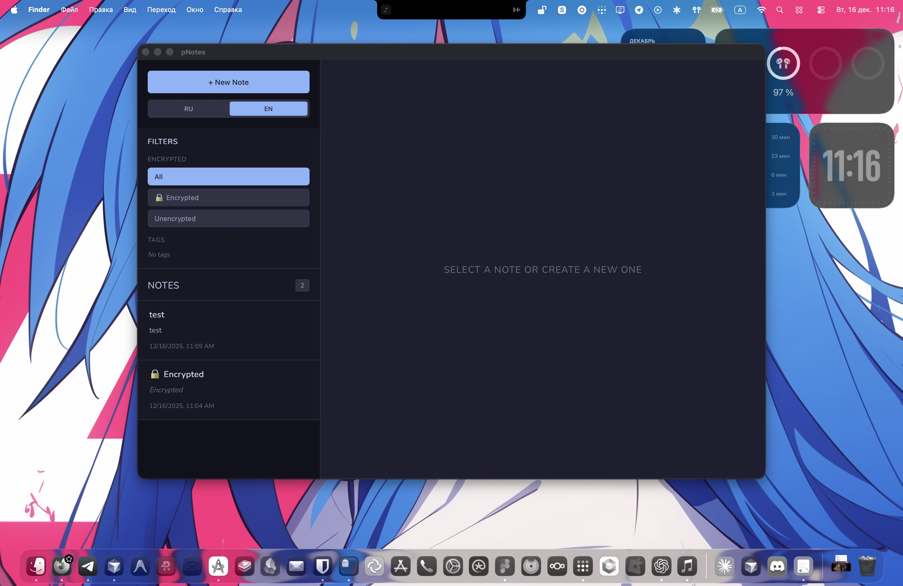

<div align="center">
  

  # pNotes

  A minimal desktop application for private notes with local encryption.

  [](https://www.gnu.org/licenses/gpl-3.0)
  [](https://golang.org/)
  [](https://wails.io/)
  [](https://github.com/PRNZ-NET/pNotes)
  [](https://www.sqlite.org/)

  [Features](#features) • [Installation](#installation) • [Usage](#usage) • [Development](#development) • [License](#license)
</div>

## Screenshot

<div align="center">
  
  <p><em>pNotes running on desktop</em></p>
</div>

## Features

### Security
- Local AES-256-GCM encryption
- Password-protected notes
- Data is encrypted on your machine only

### Notes
- Markdown support (GitHub-flavored)
- Editor, preview or split view
- Live rendering while typing

### Organization
- Tags for grouping notes
- Filter by tags or encryption state
- Simple text search

### Performance
- SQLite database
- Indexed queries
- WAL mode enabled
- Handles large note collections without noticeable lag

### Languages
- English
- Russian
- Easy to extend with new translations

### Interface
- Dark theme
- Minimal layout
- Focus on content, not UI noise

## Installation

### Requirements
- Go 1.23+
- Node.js 18+
- Wails CLI v2

### Build from source

Clone the repository:

```bash
git clone https://github.com/PRNZ-NET/pNotes.git
cd pNotes
```

Install Wails (if needed):

```bash
go install github.com/wailsapp/wails/v2/cmd/wails@latest
```

Install frontend dependencies:

```bash
cd frontend
npm install
cd ..
```

Build the app:

```bash
wails build
```

The binary will be available in `build/bin`.

### Development mode

```bash
wails dev
```

## Usage

### Creating notes
1. Click New Note
2. Enter title and content
3. Use Markdown if needed
4. Add tags
5. Save

### Encrypting notes
1. Enable Encrypt note
2. Enter a password
3. Confirm it
4. The note is stored encrypted locally

### Opening encrypted notes
1. Click a locked note
2. Enter the password
3. The note is decrypted in memory

### Filtering
- By tags
- By encryption state
- By text search

### Editor modes
- Edit
- Preview
- Split view

## Development

### Project structure

```
pNotes/
├── internal/
│   ├── errors/
│   ├── interfaces/
│   ├── models/
│   ├── repository/
│   ├── services/
│   └── utils/
├── frontend/
│   ├── src/
│   │   ├── components/
│   │   ├── hooks/
│   │   ├── i18n/
│   │   └── types/
│   └── package.json
├── app.go
├── main.go
└── wails.json
```

### Stack

Backend:
- Go
- Wails v2
- SQLite
- AES-256-GCM

Frontend:
- React
- TypeScript
- Vite
- react-markdown

### Architecture
- Clean separation of layers
- Repository pattern
- Service-based logic
- No external services required

## Security

- Encryption: AES-256-GCM
- Key derivation: PBKDF2 (100k iterations)
- Per-note salt and nonce

Keys are derived from the password and never stored.
All data stays local.

## License

Licensed under GNU GPL v3.0.
See the LICENSE file for details.

## Contributing

Pull requests are welcome.
1. Fork the repo
2. Create a branch
3. Commit changes
4. Open a PR

## Author

Gray
- Email: postmaster@prnz.net
- GitHub: https://github.com/PRNZ-NET

<div align="center">
  <p>PRNZ</p>
</div>
